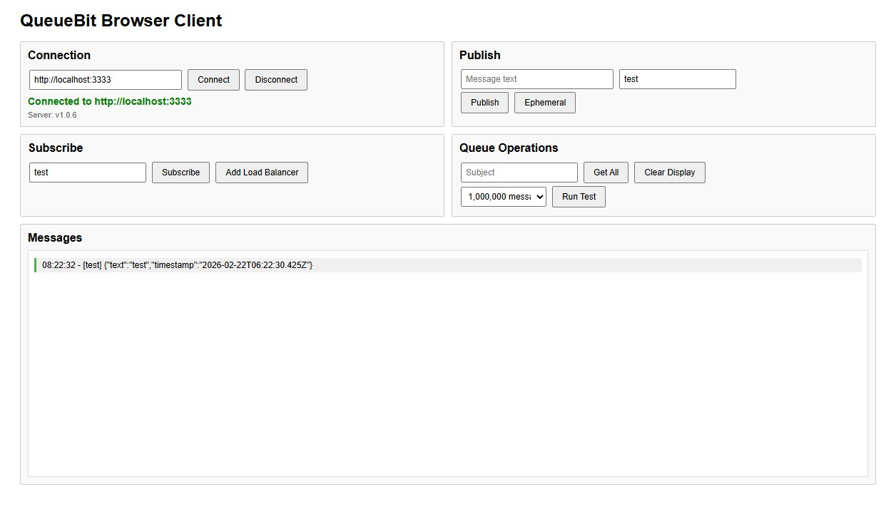

# QueueBit

A high performance socket-based message queue server with guaranteed delivery, compatible with NATS queue patterns.  

Built-in Load Balancer with round-robin delivery. (see examples).  

If you need a pubsub between client and server, or server to server, this is a good choice.

It can run in-process in an existing Node.js app, separately as a standalone server, or run clients 
in the backend and/or frontend.
A frontend in examples (qpanel.html) can help test the server.

## Installation
```
npm install @usermetrics/queuebit
```


## Features

- WebSocket-based message queue
- Subject-based message routing
- Load balancer with round-robin delivery (each message goes to exactly one worker)
- Message expiry support
- Ephemeral messages (remove after read)
- Guaranteed delivery to all regular subscribers
- Existing messages replayed to new regular subscribers
- NATS-compatible API patterns
- Browser client support

## Documentation

- **[Quick Start Guide](./docs/QUICKSTART.md)** - Get started in 5 minutes
- **[API Reference](./docs/API.md)** - Complete API documentation
- **[Examples](./docs/EXAMPLES.md)** - Practical examples for common use cases

## Quick Start

### Start the Server in-process with a node app
#### QueueBit runs with the main app. This can reduce costs for simple apps running the cloud.

```javascript
const { QueueBitServer } = require('./src/server');
const server = new QueueBitServer({ port: 3333 });
```

### Start the Server with monitoring
```javascript
const { QueueBitServer } = require('../../src/server');
const PORT = 3333;
new QueueBitServer({ port: PORT, 
    monitorInterval: 1000, 
    monitorCallback: (data) => {
    console.log(data);
} });
```

### Start the Server as a standalone process
#### The server runs standalone
On Windows:
```cmd
start_server.cmd
```

### Node.js Client

```javascript
const { QueueBitClient } = require('./src/client-node');

const client = new QueueBitClient('http://localhost:3333');

// Subscribe to messages
await client.subscribe((message) => {
  console.log('Received:', message.data);
}, { subject: 'events' });

// Publish a message
await client.publish({ hello: 'world' }, { subject: 'events' });
```

### Browser Client

```html
<script src="https://cdn.socket.io/4.7.2/socket.io.min.js"></script>
<script src="src/client-browser.js"></script>
<script>
  const client = new QueueBitClient('http://localhost:3333');
  client.subscribe((msg) => console.log('Received:', msg.data), { subject: 'events' });
  client.publish({ hello: 'world from browser!' }, { subject: 'events' });
</script>
```

See [`examples/qpanel.html`](./examples/qpanel.html) for a complete browser dashboard.  
Open it with Live Server in VS Code to test.

### In-Process (Server + Client in Same Process)

```javascript
const { QueueBitServer } = require('./src/server');
const { QueueBitClient } = require('./src/client-node');

const server = new QueueBitServer({ port: 3333 });
const client = new QueueBitClient('http://localhost:3333');

setTimeout(async () => {
  await client.subscribe((msg) => console.log('Got:', msg.data));
  await client.publish({ hello: 'world' });
}, 500);
```

## Testing Control Panel
#### run qpanel.html with live server in vscode  


## API Overview

### Server Options

| Option | Type | Default | Description |
|--------|------|---------|-------------|
| `port` | number | 3333 | Server port |
| `maxQueueSize` | number | 10000 | Max messages per subject |

### Client Methods

#### `publish(message, options)`
Publish a message to the queue.

| Option | Type | Description |
|--------|------|-------------|
| `subject` | string | Message subject/topic (default: `'default'`) |
| `expiry` | Date | Message expiration date |
| `removeAfterRead` | boolean | Ephemeral. Remove after first delivery |

#### `subscribe(callback, options)`
Subscribe to messages. Existing messages are replayed to new regular subscribers.

| Option | Type | Description |
|--------|------|-------------|
| `subject` | string | Subscribe to specific subject (default: `'default'`) |
| `queue` | string | Unique name to join the load balancer with round-robin delivery |

#### `unsubscribe(options)` · `getMessages(options)` · `disconnect()`

See [API Reference](./docs/API.md) for full details.

## Load Balancer

Each worker subscribes with a **unique `queue` name** and gets its own load balancer ID.  
Messages are distributed round-robin. Each message goes to exactly **one** worker.

```javascript
// Worker 1 → LB#1
await worker1.subscribe((msg) => {
  console.log(`LB#${msg.loadBalancerId}:`, msg.data);
}, { subject: 'tasks', queue: 'worker-1' });

// Worker 2 → LB#2
await worker2.subscribe((msg) => {
  console.log(`LB#${msg.loadBalancerId}:`, msg.data);
}, { subject: 'tasks', queue: 'worker-2' });

// Publishes cycle: LB#1 → LB#2 → LB#1 → LB#2 ...
```

## Examples

| File | Description |
|------|-------------|
| [`examples/standalone/server.js`](./examples/standalone/server.js) | Standalone QueueBit server with monitoring |
| [`examples/standalone/start.cmd`](./examples/standalone/start.cmd) | Start the standalone server |
| [`examples/client/server2server.js`](./examples/client/server2server.js) | HTTP server using an external QueueBit server |
| [`examples/client/start.cmd`](./examples/client/start.cmd) | Start the client example |
| [`examples/inprocess/inprocessserver.js`](./examples/inprocess/inprocessserver.js) | HTTP server with QueueBit running in-process |
| [`examples/inprocess/start.cmd`](./examples/inprocess/start.cmd) | Start the in-process example |
| [`examples/loadbalancer/loadbalancer.js`](./examples/loadbalancer/loadbalancer.js) | Load balancer demo with 3 workers |
| [`examples/loadbalancer/server.js`](./examples/loadbalancer/server.js) | Server for load balancer demo |
| [`examples/loadbalancer/start.cmd`](./examples/loadbalancer/start.cmd) | Start the load balancer demo |
| [`examples/logger/logger.js`](./examples/logger/logger.js) | Log all messages from the default subject |
| [`examples/logger/start.cmd`](./examples/logger/start.cmd) | Start the logger example |
| [`examples/qpanel.html`](./examples/qpanel.html) | Browser dashboard |
| [`test/test-harness.js`](./test/test-harness.js) | Full test suite |

## Performance

- **WebSocket-only transport** for reduced overhead
- **Batch message processing** (100 messages per batch)
- **Async delivery** via `setImmediate` to prevent blocking
- **No compression** for maximum speed
- **Typical throughput**: 20,000–50,000+ messages/second

## License

MIT License - See [LICENSE](LICENSE) file for details.
